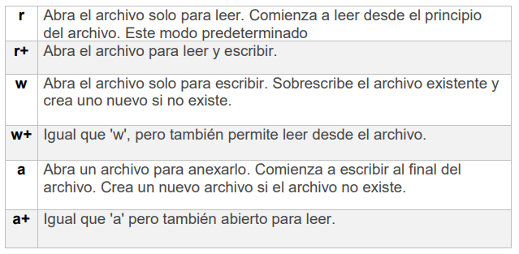

**Leyendo y escribiendo archivos**  
1.dwa rodzaje plikow b i string  
2.(ściezka)open i rodzaje otwierania  
3.czytanie  
4.wpisywanie i dodawanie  
5.pointer  
seek(),truncate(),tell()
6.close()  

Para abrir un archivo podemos utilizar open() funcion que devuelve el objeto de archivo. Dos primeros parámetros esential son filepath y modo de acceso. 
Si el archivo está en el directorio de trabajo podemos pasar el nombre del archivo como una cadena.
file = open('ejemplo.txt')

Si el archivo reside en un directorio distinto de ese, debe proporcionar la ruta de acceso completa con el nombre de archivo.

file = open('C:\\\Users\\\Andre\\\Curso\\\IN_OUT')  

Podemos abrir un con un modo de acceso diferente dependiendo de nuestras intenciones. primeramente podemos abrirlo como un archivo binario o archivo de texto, pero hoy vamos a hablar de parte de texto.

depende de lo que quierahacer con un archivo leído, escribir o anexar texto.
file = open('ejemplo.txt','r+')

Podemos leer desde el archivo usando esos métodos: 
read() - devuelve una cadena de contenido del archivo 
readline() - devuelve una línea de texto del archivo como una cadena 
readlines() - devuelve todas las líneas de texto como una lista de cadenas

jak przeczytac konkretna linie?
(albo konkretny element list z realines() albo z import linecache,metoda getline('.txt',numer_linii)

po przykladach tych funckji pokazac ze mozna leciec forem po pliku
for line in file:
    print(line)

We can write text to a file using those methods:
write() - escribe una cadena en archivo, tiene parametro cadena
writeline() - escribe una cadena en archivo, tiene parametro lista de cadenas

En el modo 'w' estas funciones sobrescriben el contenido de un archivo, pero en el modo 'a' anexan texto a partir del puntero.

Los métodos que son útiles cuando se trabaja con files:
tell() - devolverá la ubicación actual del puntero.
seek() - mueve el puntero a la nueva ubicación
truncate() - elimina el texto del puntero al final 

Es una buena práctica cerrar archivos después de trabajar con ellos usando close() funcion.

Ejercicios:
1. Escriba un programa Python para leer un archivo de texto completo.
2. Escriba un programa Python para leer las primeras 'n' líneas de un archivo.
3. Genera un archivo con 120 notas aleatorias entre 0-100, una en cada línea.
4. Escriba un programa que cuente notas de un archivo de ejercicio 3 que estén entre 0-50, 51-69 y 70-100 y escriba un número de ellas en otro archivo.

