
# Instalación de '' Python 3.7 ''

**1. Vaya a la página web: https://www.python.org/downloads/ Es una fundación oficial de Python.** 

**2. Descargue la última versión de Python**

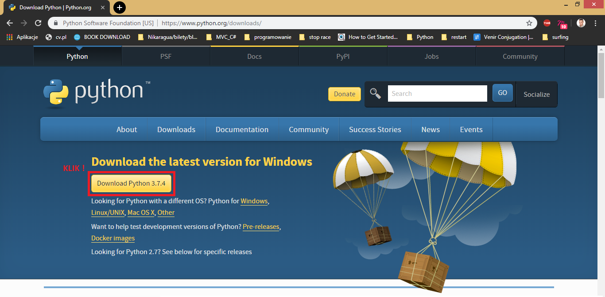

**3. Descarga en proceso**

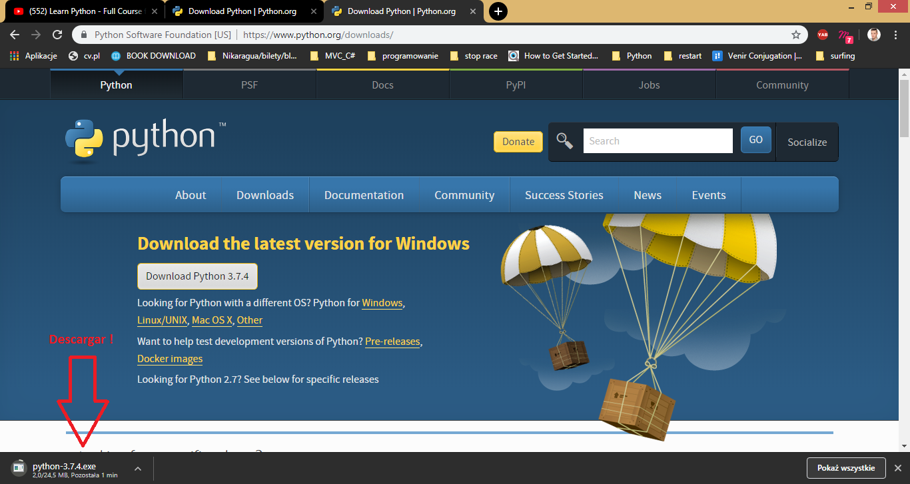

**4. Instalador abierto**

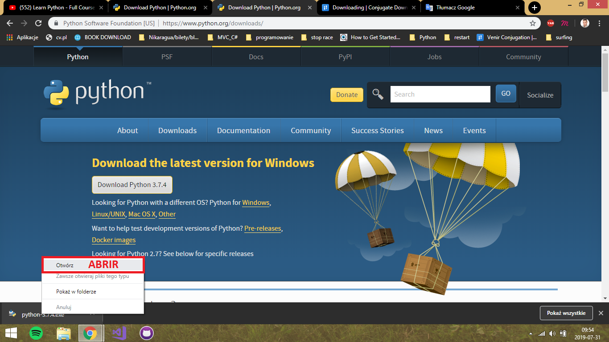

**5. Agregue '' Python 3.7 '' a PATH**

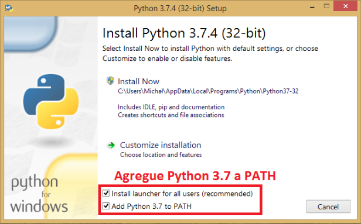

**6. Elija '' Instalar ahora '' (Install Now)**

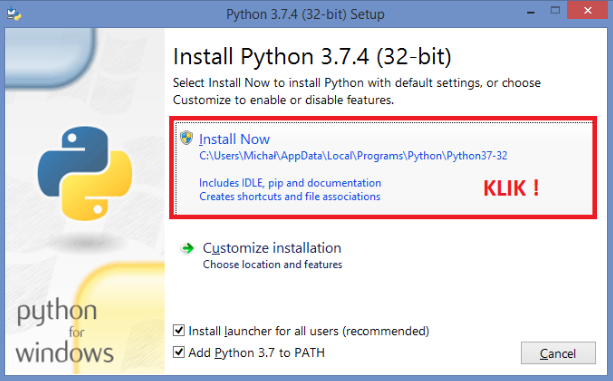

**7.Instalación en progreso**

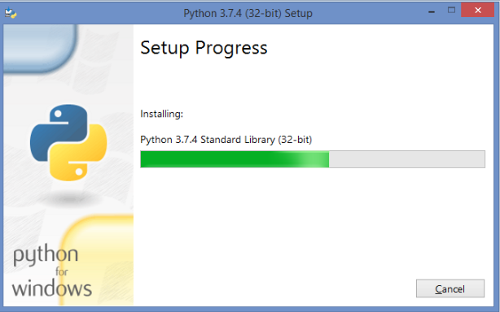

**8. Terminar la instalación**

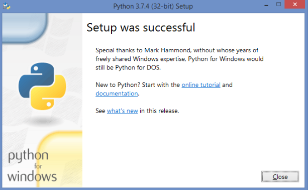

**9. Encuentra la ruta a tu Python IDLE**

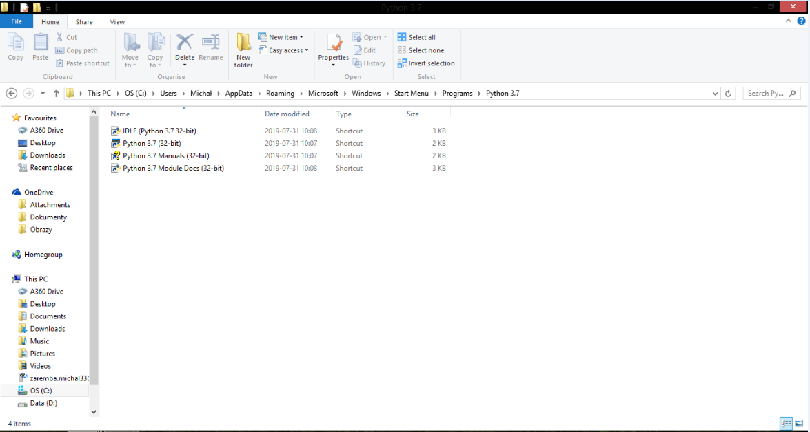

# Instalación de ''PyCharm''

Necesitamos IDE (Integrated Development Environment)- Entorno de desarrollo integrado nos ayudará a organizar la estructura de código, depurar y simplificar la búsqueda de funciones

**1.1. Vaya a la página web: http://www.jetbrains.com/pycharm/download/**

**2. Seleccione el sistema operativo y la versión de la comunidad (Community) y haga clic en descargar (Download)**

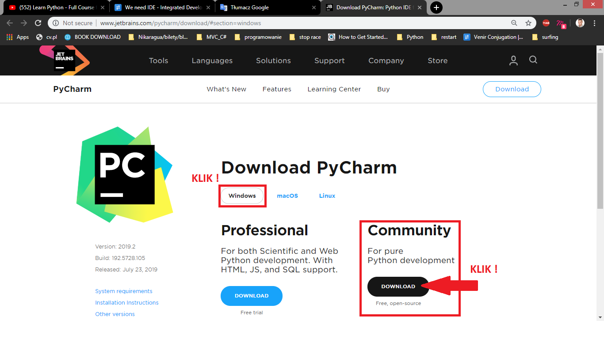

**3. Instalador abierto**

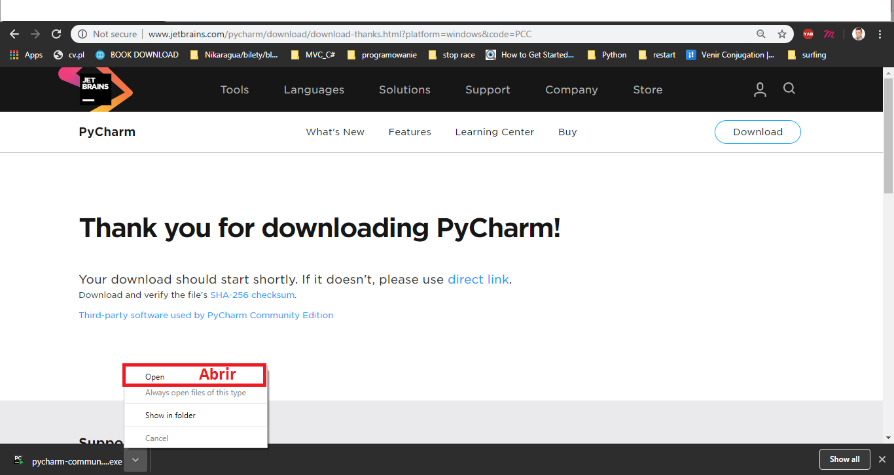

**3. Ejecutar instalación**

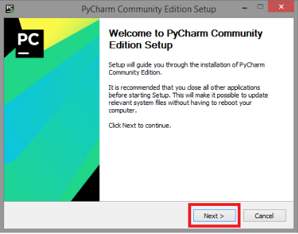

**4. Elija la carpeta de instalación (se recomienda el valor predeterminado)**

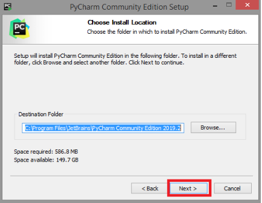

**5. Seleccione las opciones de instalación (lo más importante es '' PATH '')**

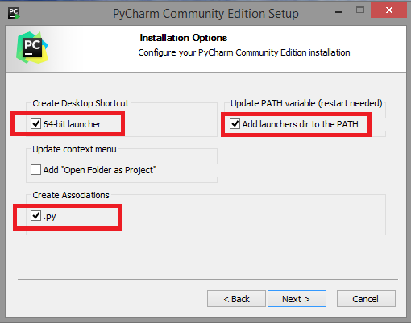

**6.Instalación en progreso**

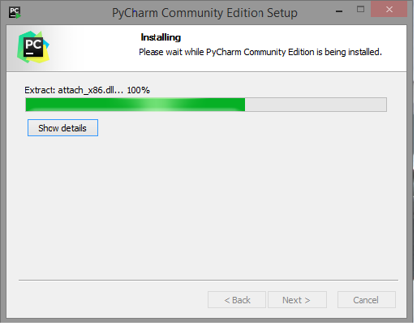

**9. Terminar la instalación y reinicie la computadora**

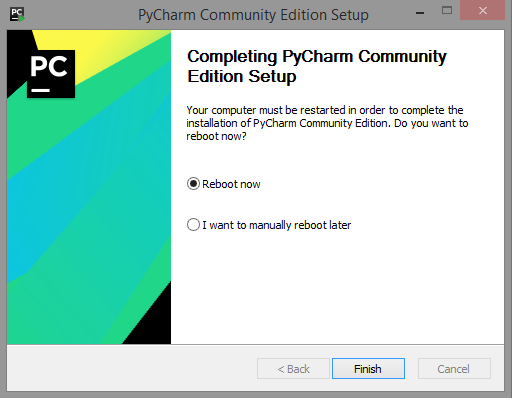

# Mi primer proyecto

**1. Iniciar Pycharm**

**2. Crear nuevo proyecto**

**3. Asigne un nombre al proyecto y elija el intérprete de la lista y haga clic en '' crear '' (Create)**

**4. Ahora podemos crear el primer script**

**5. Haga clic derecho en Project Folder => New => Python File**

**6. Nombre del script, por ejemplo, ''Hello World''**

**7. Escribe la primera línea de código ''print('Hello World!'**

**8. Ejecute su primer script y vea el resultado**

