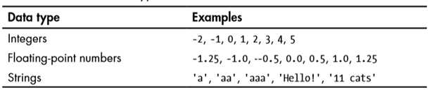
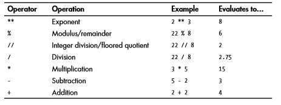
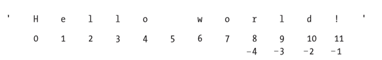
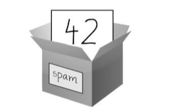

1.**Numeros** -  Python soporta dos tipos de números - integrales y numeros de punto flotante. (Tambien soporta números complejos pero por ahora vamos a evitarlos).  
 El intérprete actúa como una calculadora simple: puede escribir una expresión en él y escribirá el valor. 
 
 

 
Los números enteros (por ejemplo, 2, 4, 20) tienen tipo int, los que tienen una parte fraccionaria (por ejemplo, 5.0, 1.6) tienen tipo float.

**Cadenas**  
Las cadenas están definidas con comillas sencillas o compuestas  .
micadena = 'Hola'  
micadena = "Hola"
micadena = "No te preocupes de los 'apostofres' usando comillas dobles"  

**Indexación de cadenas**

 

tutaj postawowe operacje w interpreterze(word[2:] itd...)

**Almacenar valores en variables**  
 spam = 42   
Esta declaracion significa que spam almanece numero integrale 42.
 

Una variable se inicializa la primera vez que se almacena un valor en ella. Cuando se asigna una variable a un nuevo valor, se olvida el valor antiguo.

spam = 'Hello'  
spam = 'Goodbye'  

**Funciones basicos de Python**  

**Funcion print()**  
La función print() muestra el valor de cadena dentro de los paréntesis en la pantalla.  
Cuando Python ejecuta esta línea, se dice que Python está llamando a la función print() y que el valor de cadena se pasa a la función. Un valor que se pasa a una llamada de función es un argumento.

**Funcion input()**  
La función input() espera a que el usuario escriba texto en el teclado y pulse ENTER.

**Funcion len()**  
Puede pasar la función len() un valor de cadena (o una variable que contenga una cadena) y la función se evalúa como el valor entero del número de caracteres de esa cadena.  

**Funciones str(),int(),float()**  
La función str() se puede pasar un valor entero y se evaluará como una versión de valor de cadena de la misma.  
Las funciones str(), int() y float() se evaluarán como las formas string, integer y floating del valor que pase, respectivamente  
(tu bardziej prezentacja w intepreterze)

