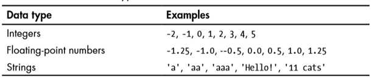
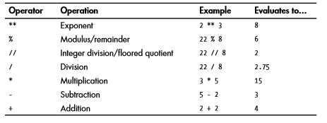
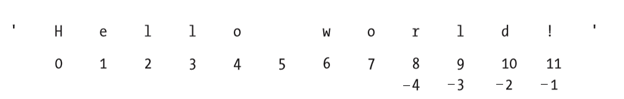
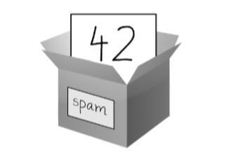

1.**Numeros** -  Python soporta dos tipos de números enteros (int - integer) y numeros reales (float). (Tambien soporta números complejos pero por ahora vamos a evitarlos).  
 El interpreter actúa como una calculadora simple: puede escribir una expresión y escribirá el valor. 
 
 ** - exponente   
 % - modulate  (residuo)
 // - division de enteros 
 / - division de reales  
 '-' - la resta  
 '+' - la adicion  
 

 
Los enteros (por ejemplo, 2, 4, 20) tienen tipo int, los que tienen una parte fraccionaria (por ejemplo, 5.0, 1.6) tienen tipo float.

**Cadenas**  ( string )  
Las cadenas están  definidas con comillas sencillas o compuestas  .
micadena = 'Hola'  
micadena = "Hola"
micadena = "No te preocupes de los 'apostofres' usando comillas dobles"  

**Indexación de cadenas**

 

tutaj postawowe operacje w interpreterze(word[2:] itd...)  
cadena*5
 

**Almacenar valores en variables**  
 spam = 42   
Esta declaracion significa que variable que se llama 'spam'  almacena el numero entero 42. Podemos imaginar una variable como una caja. 

(nazwy zmiennych tylko litery i numery)    
spam SPAM SPam   
spam23 moze 23spam   nie    
#spam \spam sp*am

dobra praktyka zeby nazywac zmienne

Una variable se inicializa la primera vez que se almacena un valor en ella. Cuando se asigna una variable a un nuevo valor, se olvida el valor antiguo.

spam = 'Hello'  
spam = 'Goodbye'  

**Funciones basicos de Python**  

**Funcion print()**  
La función print() imprime el valor de cadena dentro de los paréntesis en la pantalla.  
Cuando Python ejecuta esta línea, se dice que Python está llamando a la función print() y que el valor de cadena se pasa a la función. Un valor que se pasa a una llamada de función es un argumento.  

print z przecinkami, z plusami

**Funcion input()**  
La función input() espera a que el usuario escriba texto en el teclado y pulse ENTER. input() siempre devuelve una cadena!

**Funcion len()**  
Luego de que se ha introducido en la funcion len() como un argumento una cadena o una variable que contenga una cadena, la función da como resultado el valor entero del número de caracteres de esa cadena. 

**Funciones str(),int(),float()**  
 En la función str() se puede pasar un valor entero como argumento de la misma y se evaluará como una versión de valor de cadena.  
Las funciones str(), int() y float() daran como resultados cadena (texto), numeros enteros y numeros reales, respectivamente.  
(tu bardziej prezentacja w intepreterze)  
(uzyc wszystkiego    
np print('Nueva frase por ejemplo + variable + str(costam)')

Napisac przykladowy program zeby mieli przyklad do dwoich zadan.

Ejercicios:
1. Escriba un programa que solicite radio(r) y anote el área (π r^2), el circuito(2πr),el diámetro(2r) de un círculo.

2. Escriba un programa que solicite datos personales: nombre, apellidos, anho de nacimiento, nacionalidad y los imprime abajo en una frase.
"Me llamo [nombre][apellidos], tengo [edad] anos y soy de [nacionalidad]"

