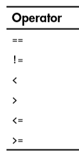
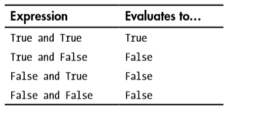
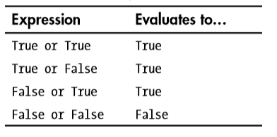
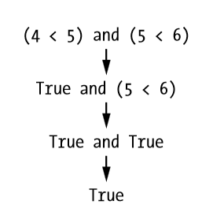
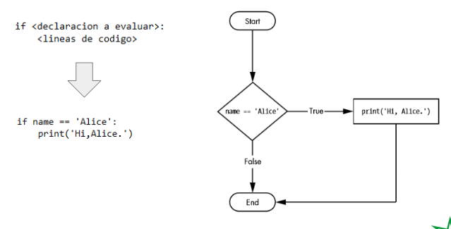
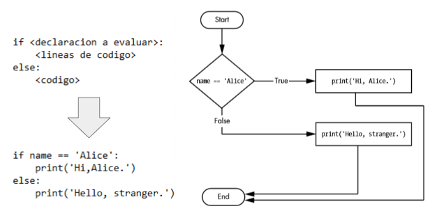
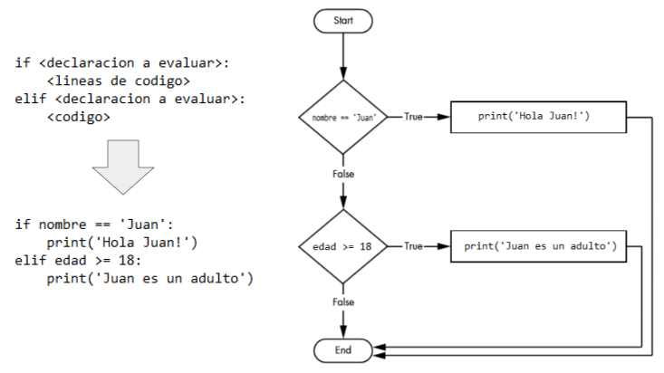

**Valores booleanos**  
El tipo de datos booleanos solo tiene dos valores: True(verdadero) y False(falso). Nuestros programas decidirán qué hacer dependiendo de valores de las variables booleanas

**Operadores de comparacion**  
  
Ejemplos:  
6 == 6  -> True(verdadero)  
6 == 7  -> False(falso)
‘hola’ == ‘hola’ -> True  

4 != 3  -> True  
4 != 4  -> False    
‘hola’ != ‘adios’ -> True  

4 < 5   -> True  
4 > 5   -> False  

'<=' (menos o igual)  
'>=' (mas o igual)    
15 >= 15 -> True 
15 >= 14 -> True  
15 >= 16 -> False  

tu zabawa w interpreterze

**AND,OR and NOT operators**  

Ejemplos:  

Pytanie do publicznosci  
 (4 < 5) and (5 < 6) True or False?

 
 
 El operador 'not' simplemente se evalúa como el valor booleano opuesto  

not pokazac w interpreterze

**'If' sentencia**  
Queremos que nuestro programa tome sus propias decisiones, para esta tarea vamos a utilizar las sentencias de control.

'if' sentencia - esta sentencia podemos leerla asi: "Si esta condición es verdadera, ejecute el código".

 
 
 POWIEDZIEC O BLOKACH KODU
 
**else sentencia**  
La sentencia 'else' solo se ejecuta cuando la condición de la instrucción 'if' es False(falso).

  

**elif sentencia**    
La instrucción 'elif' es una sentencia que siempre sigue a una sentencia 'if' o otra sentencia 'elif'. Proporciona otra condición que se comprueba solo si alguna de las condiciones anteriores era False.
  
 Poprosić zeby sie pobawili kodem zeby sprobowali napisać cokolwiek  

Ejercicios:
1. Escriba un programa que pide un numero y determine si el número es impar o par y luego imprima la respuesta.
2. Escriba un programa que pide edad(numero) y determine si una persona es adulta y leugo imprima la respuesta.
3. Combine ejercicio uno y dos. Escriba un programa que pide edad(numero) determine si la persona es adulta y si la edad es un numero par. 
4. Continue ejercicio 3, si persona es adulta pregunte el nombre, luego imprima 'Hola,[nombre]'.

Change the program from exercise 3 so it works like this:
if the person is adult, program will ask for the name and will print 'Hi,[name]'

