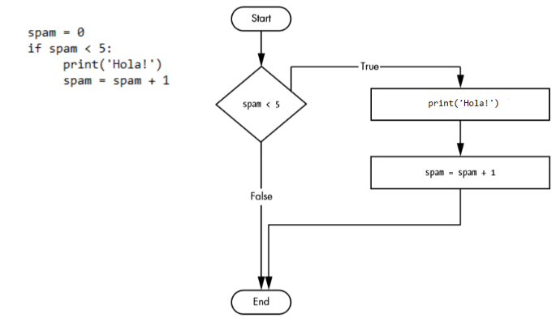
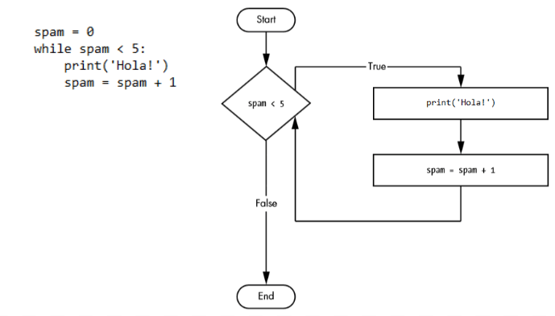
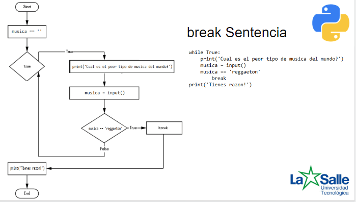
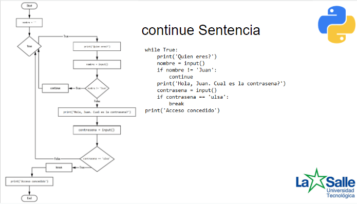
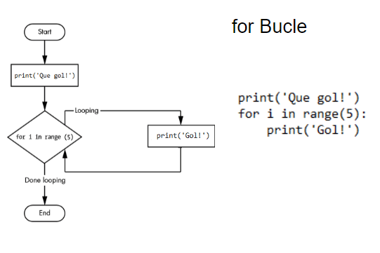
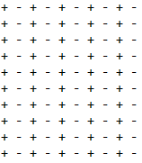

***Bucles***   
**while Bucle**  
Puede hacer que un bloque de código se ejecute una y otra vez con una instrucción 'while'. El código de una cláusula 'while' se ejecutará siempre que la condición de la instrucción 'while' sea True.  
Instruction 'while' se parece a instruction 'if'.

  
Estas sentencias son similares: 'if' y 'while' comprueban el valor del spam, y si es inferior a cinco, imprimen un mensaje. En bucle 'while' si la condición es verdadera continúa con la siguiente iteración.

**break Sentencia**  
Si queremos salir del bucle antes del final de la iteración, podemos usar la instrucción 'break'. Si la ejecución alcanza una instrucción 'break', sale inmediatamente del bucle 'while'.

**continue Sentencia**  
Instruccion 'continue' se utiliza dentro de bucles. Cuando la ejecución del programa alcanza una instrucción 'continue', la ejecución del programa vuelve inmediatamente al inicio del bucle.

Ejercicios:
1. Escriba un programa que pida el número de palabras 'Gol!' y luego las escriba.
2. Escriba un programa que escriba todos los números pares que son inferiores a 60 excepto los números que son desviables por 10. 
3.  Escriba un juego sencillo en el que tendrás que adivinar un número secreto aleatorio entre 0-100, donde el juego te dice si el número adivinado es demasiado bajo o demasiado alto.  
4. Modifica el juego del ejercicio 4. Por ejemplo: si adivinas 5 veces y no adivinas el número secreto, pierdes.

**for Bucle**  
El bucle 'While' itera hasta que la condición del bucle es True, pero si queremos ejecutar un bloque de código un determinado numero de veces, es mejor usar el bucle 'for'.  
La instrucción 'for' de Python corre la iteración los elementos de cualquier secuencia (una cadena o una lista), en el orden en que aparecen en la secuencia.

Para empezar trabajando con bucle 'for' tenemos que conocer la function 'range()'. Si se necesita iterar sobre una secuencia de números, es apropiado utilizar la función integrada range(), la cual genera
progresiones aritméticas.

(tu pokazac w interpreterze)
for i in range(10):  
for x in range(3,7):  
for z in range(0,10,2):  
for i in range(10,0,-1):  
for letra in 'palabra':  

Podemos usar bucles dentro de bucles. Por ejemplo:  
plik.py przygotowany

DO CWICZENIA DRUGIEGO POKAZAC print(end="")!!!!!!
Ejercicios:
1. Escriba un programa que solicite un número y luego imprima esta cantidad de números usando un bucle 'for', luego escriba un programa equivalente usando el bucle 'while'.
2. Escriba un programa Python para construir el siguiente patrón, utilizando un bucle en un bucle.
  
( tu przypomniec o print() i print(end=''))
3. Escriba una tabla de mulitplacación de un número elegido.
4. Escribe un programa que te pida una frase y luego la imprime en un orden reverso usando 'for' bucle.

