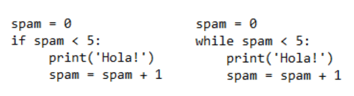

***Bucles***   
**while Bucle**
Puede hacer que un bloque de código se ejecute una y otra vez con una instrucción 'while'. El código de una cláusula 'while' se ejecutará siempre que la condición de la instrucción 'while' sea True.  
Instruction 'while' se parece a instruction 'if'.

Estas declaraciones son similares: 'if' y 'while' comprueban el valor del spam, y si es inferior a cinco, imprimen un mensaje. En caso de bucle 'while' si la condición es verdadera continúa con la siguiente iteración.

**break Sentencia**  
Si queremos salir del bucle antes del final de la iteración, podemos usar la instrucción 'break'. Si la ejecución alcanza una instrucción 'break', sale inmediatamente de la cláusula del bucle 'while'.

**continue Sentencia**  
Instruccion 'continue' se utiliza dentro de bucles como la instruccion 'break'. Cuando la ejecución del programa alcanza una instrucción 'continue', la ejecución del programa vuelve inmediatamente al inicio del bucle.

Ejercicios:
1. Write a program which asks for number of words 'Gol!' and then rights it.
2. Write a program which writes all even numbers which are lower than 60 except the numbers which are devidible by 10. 
3.  Write a simple game in which you guess a secret number between 0-100, where the game tells you if the guessed number is too low or too high.

