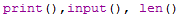

**Functiones**

Ya estamos familiarizados con las funciones print(), input() y len() de los capítulos anteriores. Python proporciona varias funciones integradas, pero también puede escribir sus propias funciones. Una función es como un pequeño programa dentro de un programa.

Para crear la función usamos la instrucción "def"

El código en una función se ejecuta cuando se llama a la función, no cuando se define la función.

Un propósito principal de las funciones es agrupar código que se ejecuta varias veces. Sin una función desafiada, tendría que copiar y pegar este código cada vez

La desduplicación hace que sus programas sean más cortos, fáciles de leer y más fáciles de actualizar.

**Declaración de "Return" (retorno)**

Los cuerpos de función pueden contener una o más declaraciones de retorno. Se pueden ubicar en cualquier parte del cuerpo de la función. Una declaración return finaliza la ejecución de la llamada a la función y "devuelve" el resultado, es decir, el valor de la expresión que sigue a la palabra clave return. Si la sentencia return no tiene una expresión, se devuelve el valor especial None.

**Declaraciones "def" con parámetros**

También puede desafiar sus propias funciones que aceptan argumentos

La desafiación de la función "hola()" en este programa tiene un parámetro llamado "name". Un parámetro es una variable en la que se almacena un argumento cuando se llama a una función. El puño vez que se llama a la función "hola()", es con el argumento 'Michał'. La ejecución del programa entra en la función y la variable "name" se establece automáticamente en 'Michał', que es lo que se imprime mediante la instrucción print(). 
Los parámetros son que el valor almacenado en un parámetro se olvida cuando se devuelve la función.

**Variables local y global**

Se dice que los parámetros y variables que se asignan en una función llamada existen en el variable local de esa función. Se dice que las variables que se asignan fuera de todas las funciones existen en el variable global. Una variable que existe en un variable local se denomina variable local, mientras que una variable que existe en el variable global se denomina variable global. Una variable debe ser una u otra. No puede ser tanto local como global.

Las variables locales no se pueden utilizar en el variables global

Los variables locales no pueden usar variables en otros variables locales

Las variables globales se pueden leer desde un variables locales

Variables locales y globales con el mismo nombre

La Declaración global

**Ejercicios:**

1. La secuencia de Collatz

Escriba una función denominada collatz() que tenga un parámetro denominado número. Si el número es par, entonces collatz() debe imprimir el número // 2 y devolver este valor. Si el número es impar, entonces collatz() debe imprimir y devolver 3 * número 1.

Sugerencia: Un número entero es par si el número % 2 == 0, y es impar si el número % 2 == 1 

2. Puntaje final de clases

Crea un correo electrónico para informar a los estudiantes sobre el curso final grada:

Si la calificación no es suficiente (0-69), informe sobre el examen del segundo trimestre.

Si la calificación es buena (70-79), anímate a mejorar en el próximo año.

Si la calificación es muy buena (80-89), felicidades.
Si la calificación es excelente (90-100), ¡deseamos todo lo mejor!

La entrada debe tener nombre y puntaje

