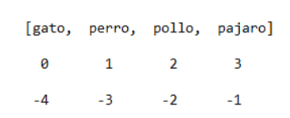
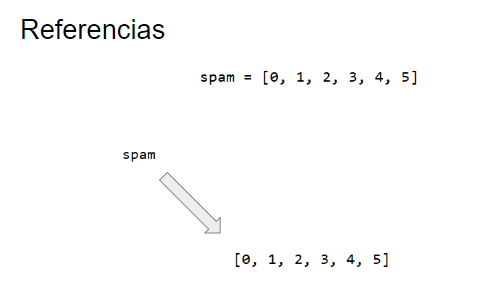

**Listas**  
Una lista es un valor que contiene varios valores en una secuencia ordenada.  
Indexamos listas al igual que las cadenas

zabawa w interpreterze  
[1,2,3]  
['pan','agua','jamon']  
['hola', 4, True, 'jajaja', 12]  
spam = [['gato','perro'],[2,4,6,8]]  

spam = ['pan','huevo','agua','patata']

Podemos obtener varios valores de la lista como eso.  
spam[0:4]  
spam[1:3]  
spam[0:-1]  
spam[:2]  
spam[1:]

Podemos cambiar valores de la lista como eso:  
spam[1] = 'algo'
spam[2] = spam[1]

Para eliminar valores de la lista podemos usar 'del' sentencia. Todos los valores de la lista después del valor eliminado se moverán hacia arriba un índice.

del spam[2]

El operador puede combinar dos listas para crear un nuevo valor de lista de la misma manera que combina dos cadenas en un nuevo valor de cadena. El operador * también se puede utilizar con una lista y un valor entero para replicar la lista.

spam = [1,2,3]  
lista = ['gato','perro']  
spam + lista  
spam * 3  

Como dijimos antes, el bucle 'for' corre la iteración los elementos de cualquier secuencia.

for i in range(4):  
for i in [1,2,3,4]:  
for i in ['perro','gato','pollo']:  

**IN y NOT IN operadores**  
Si queremos comprobar si un valor específico está o no está en la lista, podemos usar operadores booleanos 'in' o 'not in'.

spam = ['hi','hola','siema','hello']  
'hola' in spam   
'cześć' not in spam  
'hola' not in

**Metodos**  
Un método es lo mismo que una función, excepto que se "llama" a un valor.  
Cada tipo de datos tiene su propio conjunto de métodos. El tipo de datos de lista, por ejemplo, tiene varios métodos útiles para buscar, agregar, quitar y manipular valores en una lista.

Los valores de lista tienen un método index() al que se puede pasar un valor, y si ese valor existe en la lista, se devuelve el índice del valor  

Por ejemplo: .index() metodo  
spam = ['hi','hola','siema','hello']    
spam.index('hola')

spam = ['hi','hola','siema','hello','hola']  
spam.index('hola')

Para añadir nuevos valores a una lista, utilizamos los métodos append() y insert().
append() Añade el argumento al final de la lista..

spam.append('czesc')

El insert() método puede insertar un valor en cualquier índice en la lista. El primer argumento para insertar() es el índice del valor nuevo, y el segundo argumento es el nuevo valor que se va a insertar.

spam.insert(1,'algo')

Para eliminar un valor de una lista, usamos metodo 'remove()'

spam.remove('hola')

Las listas de valores numéricos o listas de cadenas se pueden ordenar con el método sort().  

spam = [2,1,-7,3.14,-2]  
spam.sort()  

También puede pasar True para que el argumento de palabra clave inversa ordene los valores en orden inverso.  

spam.sort(reverse=True)

spam = ['Juan','Alden','Santiago','Byron']  
spam.sort()  
spam = ['Juan','Alden','Santiago','Byron','juan','alden','santiago','byron']

**Mutable y inmutable tipos de data**  
Pero las listas y las cadenas son diferentes de una manera importante. Un valor de lista es un tipo de datos mutable: puede tener valores agregados, eliminados o cambiados. Sin embargo, una cadena es inmutable: no se puede cambiar.

interpreter
spam = 'cadena es inmutable'
spam[3] = 'g'

**Tuples**  
El tipo de datos tupla es casi idéntico al tipo de datos de lista, excepto de dos maneras.  
1. Primero, las tuplas se escriben con paréntesis ( y )
2. Segundo, tuples, como cadenas, son inmutables.

ejemplo = ('hola',42,0.5)
ejemplo[0]
ejemplo[0] = 'hi'

Podemos convertir una lista a tuple y un tuple a una lista con tuple() y list() funciones.

tuple(['perro','gato',8])
list(('perro','gato',8))

**Referencias**  
Las variables almacenan cadenas y valores enteros.  

spam = 42  
queso = spam  
spam = 100

Pero las listas no funcionan así. Cuando se asigna una lista a una variable, en realidad se asigna una referencia de lista a la variable. Una referencia es un valor que apunta a una particion de datos.

spam = [0,1,2,3,4,5]  
queso = spam  
spam[1] = 'Hola'  
spam
queso

Si no queremos trabajar en una determinada lista, podemos copiarla usando el método copy(). De esta manera obtenemos una referencia a otra lista pero con los mismos valores.

import copy   
spam = [0,1,2,3,4,5]   
cheese = copy.copy(spam)  
spam[1] = 'Hola'  
spam  
cheese  

Ejercicios
1. Escriba una función que tome un valor de lista como argumento y devuelva una cadena con todos los elementos separados por una coma y un espacio. La función debe funcionar con cualquier lista.
2. Escriba una función que tome dos listas como argumentos y devuelva una lista de valores comunes de esas listas sin duplicados.
3. Escriba una función que tome una lista de cadenas como argumento y devuelva una lista de cadenas sin números.

    

