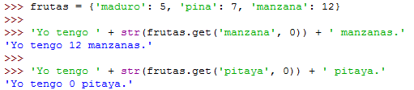

## Diccionarios

Como una lista, un diccionario es una colección de muchos valores. Pero a diferencia de los índices para listas, los índices para diccionarios pueden usar muchos tipos de datos diferentes, no solo enteros. Los índices para los diccionarios se denominan claves, y una clave con su valor asociado se denomina par clave-valor. En el código, un diccionario se escribe con llaves, {} 

*W SHEL-U*

A diferencia de las listas, los elementos de los diccionarios están desordenados.

*W SHEL-U*

Métodos: keys(), values(), and items() 

Los valores devueltos por estos métodos no son listas verdaderas: no pueden ser modifid y no tienen un método append()

Método get()

Toma dos argumentos: la clave del valor a recuperar y un valor alternativo a devolver si esa clave no existe.

*CUMPLEANOS - TASK !*

Set default - Establecer Predeterminado

El primer argumento pasado al método es la clave para verificar, y el segundo argumento es el valor a establecer en esa clave si la clave no existe. Si la clave existe, el método setdefault () devuelve el valor de la clave

*RECUENTO DE CARACTERES - TASK*

Diccionario/ lista en el diccionario

A medida que modela cosas más complicadas, es posible que necesite diccionarios y listas que contengan otros diccionarios y listas. Las listas son útiles para contener una serie ordenada de valores, y los diccionarios son útiles para asociar claves con valores.

*DICCIONARIO EN EL DICCIONARIO - TASK*

*EL TRES EN LINEA - TASK*

