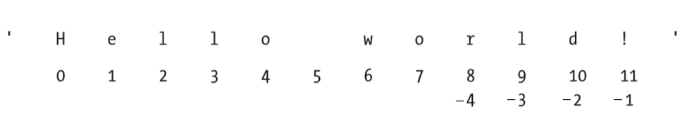
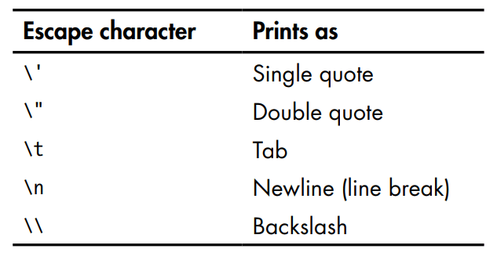

**Manipulando cadenas**  
El texto es una de las formas más comunes de datos que nuestros programas manejarán. En esta parte vamos a mejorar nuestras habilidades en la manipulación de cadenas utilizando métodos de cadena.

przypomnienie(indexowanie,in, not it itd...)  

**Escape characters - caracteres de escape**(escape fuga)
Un carácter de 'escape' le permite utilizar caracteres que, de lo contrario, son imposibles de colocar en una cadena. Un carácter de escape consta de una barra invertida ( *\\* ) seguida del carácter que desea agregar a la cadena.   

Por ejemplo:    
print('El titulo de la pelicula es \'El Rey Leon\' ')

print('Hola!')  
print('\tHola!')

print('Hola!\nQue tal?\nTodo bien?')

**Cadena cruda(raw string)**  
Puede colocar una 'r' antes de la comilla inicial de una cadena para convertirla en una cadena sin formato. Una cadena sin formato omite por completo todos los caracteres de escape y imprime cualquier barra diagonal inversa que aparezca en la cadena.

print('\t Es mi perro,\n se llama Doggy.')
print(r'\t Es mi perro,\n se llama Doggy.')

**Cadenas multilinea(Multiline Strings)**  
Hay una manera más fácil de crear cadenas de varias líneas, sin usar '\n' o '\t'. 
Podemos crear cadenas de esta manera:

print('Hola!\n\nQue tal?')  
print('''Hola!

Que tal?''')

**Útiles métodos de cadenas**
Los métodos de cadena upper() y lower() devuelven una nueva cadena donde todas las letras de la cadena original se han convertido a mayúsculas y minúsculas.  

spam = 'Hola Juan!'
spam = spam.upper()
spam
spam = spam.lower()

**Metodos de cadenas is(metodo)**
Estos métodos devuelven un valor booleano valor que describe la característica de la cadena.  

'hola'.islower()  
'hola'.isupper()  
'HOLA'.isupper()  

La isupper() y islower() métodos devolverán un valor Boolean True 
Si la cadena tiene al menos una letra y todas las letras son mayúsculas o minuscula. De lo contrario, el método devuelve False.

- isalpha() devuelve True si la cadena consta sólo de letras  
- isalnum() devuelve True si la cadena consta únicamente de letras y números
- isdecimal() devuelve True si la cadena consta únicamente de caracteres numéricos
- isspace() devuelve True si la cadena consta únicamente de espacios, pestañas y líneas nuevas

**join() y split() metodos**  

El método join() es útil cuando tiene una lista de cadenas que deben unirse en un único valor de cadena. Se llama al método join() a una cadena, se pasa una lista de cadenas y devuelve una cadena.

(join - juntar)

', '.join(['queso', 'pan', 'leche'])  
 ' '.join(['Me', 'llamo', 'Andres'])
 
El split() metodo hace lo contrario: se llama a un valor de cadena y devuelve una lista de cadenas.   

'Me llamo Andres'.split()  

De forma predeterminada, la cadena 'Me llamo Andres' se divide dondese se encuentran caracteres de espacio en blanco, como el espacio, la pestaña o los caracteres de nueva línea.  

'pan,leche,queso,agua'.split(',')

'MiABCnombreABCesABCAndres'.split('ABC')

spam = '''Hola  
Que tal?  
Todo bien?''''  
spam.split('\n')  

**strip(), rstrip(), lstrip()**  
Para quitar los espacios en blanco de una cadena podemos utilizar la funcion strip().

Ejercicios
1. Escriba una función que tome una cadena (una frase) como argumento y devuelva una cadena de una frase en la que las palabras se separan con un '_'(guion bajo).
2. Escriba un programa que convierta una cadena ,como esta(imagen), en una lista de números flotantes y escriba una suma, promedio, valor máximo y mínimo de los números de la lista.

