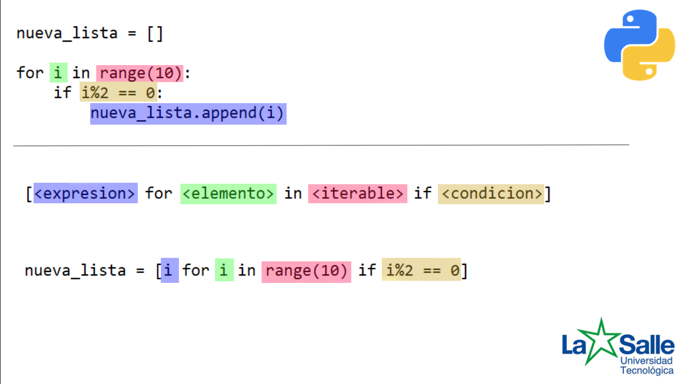

**Compresiones de listas**  
Las comprensión de listas proporcionan una forma concisa de crear listas. Las aplicaciones comunes son hacer 
nuevas listas donde cada elemento es el resultado de algunas operaciones.

Vamos a explicarlo usando ejemplos.

Przyklady:
z listy do listy 
z listy do listy stringow
z uzyciem funkcji
z dwoma if'ami

(3 obrazki i przyklady w pycharmie)

Ejercicios
1. Escriba un programa que cree la misma lista que fue creada por el bucle pero usando una comprensión.

2. Usando una comprensión de lista, cree una nueva lista llamada "positivos" a partir de la lista "números", que contiene sólo los números positivos de la lista, como numeros enteros.

3. Escriba un programa que cree la misma lista que fue creada por la comprehension pero usando un bucle.

4. Escriba una función que tome una cadena como argumento y devuelva una lista de longitudes de palabras en la cadena.

